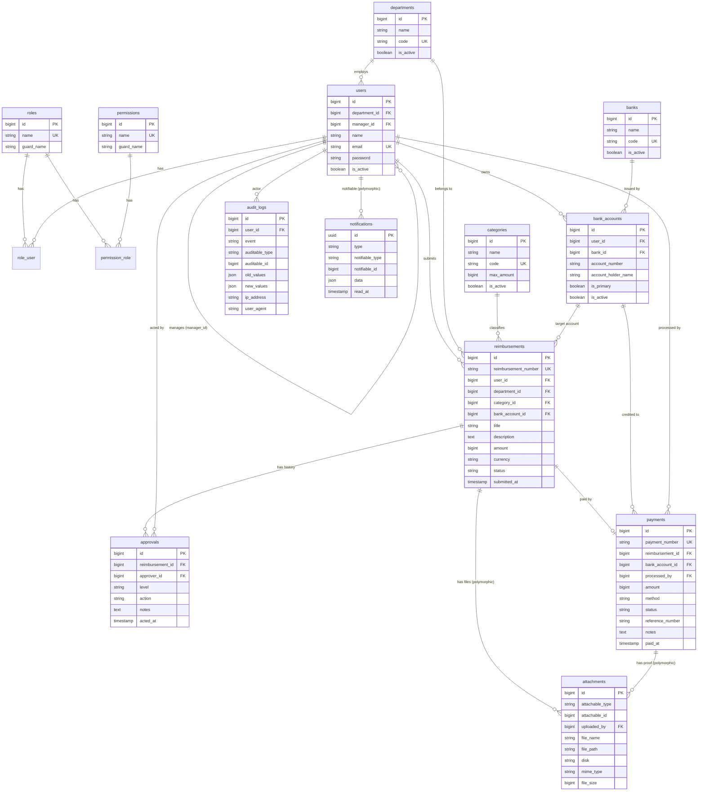

# Desain Database
# Reimbursement Management System

> **Fase:** Phase 2 — Database Design
> **DBMS:** PostgreSQL
> **Status:** Dokumen desain (belum ada migration Laravel)
> **Referensi:** [01-project-planning.md](01-project-planning.md) — role, state machine, currency
> **Tanggal:** 2026-07-16

---

## Daftar Isi
1. [Ikhtisar & Prinsip Desain](#1-ikhtisar--prinsip-desain)
2. [ERD (Entity Relationship Diagram)](#2-erd-entity-relationship-diagram)
3. [Daftar Tabel & Relasi](#3-daftar-tabel--relasi)
4. [Struktur Detail Tiap Tabel](#4-struktur-detail-tiap-tabel)
5. [Enum & State Machine](#5-enum--state-machine)
6. [Ringkasan Primary Key & Foreign Key](#6-ringkasan-primary-key--foreign-key)
7. [Constraint](#7-constraint)
8. [Index](#8-index)
9. [Normalisasi (hingga 3NF)](#9-normalisasi-hingga-3nf)
10. [Catatan Keputusan Desain](#10-catatan-keputusan-desain)

---

## 1. Ikhtisar & Prinsip Desain

Database dirancang untuk mendukung seluruh siklus reimbursement: RBAC, master data, pengajuan, approval berjenjang, pembayaran, file, notifikasi, dan audit log.

**Prinsip yang dipakai:**
- **Normalisasi minimal 3NF** — tidak ada redundansi & transitive dependency (dijelaskan di bagian 9).
- **Integritas referensial** — seluruh relasi memakai foreign key dengan aturan `ON DELETE` yang eksplisit.
- **Soft delete** pada entitas bisnis penting (users, reimbursements, payments, master data) agar data historis tetap dapat diaudit.
- **Audit-friendly** — perubahan penting dicatat di `audit_logs`; nilai currency disimpan sebagai integer untuk presisi.
- **Enum di level aplikasi + CHECK constraint di DB** — status divalidasi ganda (Laravel enum cast + PostgreSQL CHECK) agar konsisten. *(Alternatif: PostgreSQL native `CREATE TYPE ... AS ENUM`; lihat bagian 10.)*
- **Currency IDR** disimpan sebagai `BIGINT` (rupiah penuh) sesuai keputusan Phase 1, kolom `currency` disediakan untuk ekstensibilitas.

**Konvensi penamaan:**
- Nama tabel: jamak, snake_case (`reimbursements`).
- Primary key: `id` (BIGSERIAL / bigIncrements).
- Foreign key: `<entitas_tunggal>_id` (`user_id`, `bank_id`).
- Timestamp: `created_at`, `updated_at`; soft delete: `deleted_at`.
- Kolom uang: `BIGINT` bertanda satuan rupiah penuh.

---

## 2. ERD (Entity Relationship Diagram)



> Catatan: `reimbursements ||--o| payments` = satu reimbursement memiliki **paling banyak satu** pembayaran aktif (dijaga partial unique index; lihat bagian 8).

---

## 3. Daftar Tabel & Relasi

| # | Tabel | Kategori | Relasi Utama |
|---|-------|----------|--------------|
| 1 | `roles` | RBAC | M:N ke users, M:N ke permissions |
| 2 | `permissions` | RBAC | M:N ke roles |
| 3 | `permission_role` | RBAC (pivot) | menghubungkan permissions–roles |
| 4 | `role_user` | RBAC (pivot) | menghubungkan roles–users |
| 5 | `departments` | Master | 1:N ke users, 1:N ke reimbursements |
| 6 | `categories` | Master | 1:N ke reimbursements |
| 7 | `banks` | Master | 1:N ke bank_accounts |
| 8 | `users` | Inti | 1:N bank_accounts, reimbursements; self-ref manager |
| 9 | `bank_accounts` | Inti | milik user, merujuk bank |
| 10 | `reimbursements` | Inti | milik user, punya approvals & payment |
| 11 | `approvals` | Transaksi | riwayat approval per reimbursement |
| 12 | `payments` | Transaksi | pembayaran atas reimbursement |
| 13 | `attachments` | Pendukung | polymorphic: reimbursement & payment |
| 14 | `audit_logs` | Pendukung | polymorphic: mencatat semua entitas |
| 15 | `notifications` | Pendukung | polymorphic notifiable (Laravel default) |
| — | `password_reset_tokens`, `sessions`, `jobs`, `failed_jobs`, `cache` | Sistem/Laravel | bawaan framework |

---

## 4. Struktur Detail Tiap Tabel

Legenda tipe: `PK` primary key, `FK` foreign key, `UK` unique, `NN` not null, `NULL` boleh null, `SD` soft delete.

### 4.1 `roles`
Menyimpan peran RBAC. Berisi 6 role kanonik: super_admin, admin, employee, manager, finance, auditor.

| Kolom | Tipe | Ket. |
|-------|------|------|
| id | BIGSERIAL | PK |
| name | VARCHAR(50) | NN, UK — mis. `manager` |
| display_name | VARCHAR(100) | NN — mis. `Manager` |
| guard_name | VARCHAR(50) | NN, default `web` |
| description | VARCHAR(255) | NULL |
| created_at / updated_at | TIMESTAMP | NN |

### 4.2 `permissions`
Hak akses granular yang dipetakan ke role. Mis. `reimbursement.create`, `payment.process`.

| Kolom | Tipe | Ket. |
|-------|------|------|
| id | BIGSERIAL | PK |
| name | VARCHAR(100) | NN, UK |
| display_name | VARCHAR(150) | NULL |
| guard_name | VARCHAR(50) | NN, default `web` |
| created_at / updated_at | TIMESTAMP | NN |

### 4.3 `permission_role` (pivot)
| Kolom | Tipe | Ket. |
|-------|------|------|
| permission_id | BIGINT | FK → permissions.id, NN |
| role_id | BIGINT | FK → roles.id, NN |
| PK gabungan | (permission_id, role_id) | mencegah duplikasi |

### 4.4 `role_user` (pivot)
| Kolom | Tipe | Ket. |
|-------|------|------|
| role_id | BIGINT | FK → roles.id, NN |
| user_id | BIGINT | FK → users.id, NN |
| PK gabungan | (role_id, user_id) | |

### 4.5 `departments`
Master unit organisasi.

| Kolom | Tipe | Ket. |
|-------|------|------|
| id | BIGSERIAL | PK |
| name | VARCHAR(100) | NN |
| code | VARCHAR(20) | NN, UK — mis. `FIN`, `IT` |
| description | VARCHAR(255) | NULL |
| is_active | BOOLEAN | NN, default true |
| created_at / updated_at | TIMESTAMP | NN |
| deleted_at | TIMESTAMP | NULL (SD) |

### 4.6 `categories`
Master kategori pengeluaran. `max_amount` = plafon opsional per kategori.

| Kolom | Tipe | Ket. |
|-------|------|------|
| id | BIGSERIAL | PK |
| name | VARCHAR(100) | NN |
| code | VARCHAR(20) | NN, UK |
| description | VARCHAR(255) | NULL |
| max_amount | BIGINT | NULL — plafon (IDR); null = tanpa batas |
| is_active | BOOLEAN | NN, default true |
| created_at / updated_at | TIMESTAMP | NN |
| deleted_at | TIMESTAMP | NULL (SD) |

### 4.7 `banks`
Master data bank (BCA, BRI, BNI, Mandiri, SeaBank — di-seed di Phase 5).

| Kolom | Tipe | Ket. |
|-------|------|------|
| id | BIGSERIAL | PK |
| name | VARCHAR(100) | NN — mis. `Bank Central Asia` |
| code | VARCHAR(20) | NN, UK — mis. `BCA` |
| swift_code | VARCHAR(20) | NULL |
| is_active | BOOLEAN | NN, default true |
| created_at / updated_at | TIMESTAMP | NN |
| deleted_at | TIMESTAMP | NULL (SD) |

### 4.8 `users`
Pengguna sistem. `manager_id` self-reference ke atasan langsung. Role diperoleh via `role_user`.

| Kolom | Tipe | Ket. |
|-------|------|------|
| id | BIGSERIAL | PK |
| department_id | BIGINT | FK → departments.id, NULL (Super Admin bisa tanpa dept) |
| manager_id | BIGINT | FK → users.id (self), NULL |
| name | VARCHAR(100) | NN |
| email | VARCHAR(150) | NN, UK |
| email_verified_at | TIMESTAMP | NULL |
| password | VARCHAR(255) | NN (hashed) |
| phone | VARCHAR(30) | NULL |
| is_active | BOOLEAN | NN, default true |
| failed_login_attempts | SMALLINT | NN, default 0 |
| locked_until | TIMESTAMP | NULL — untuk login attempt limit |
| remember_token | VARCHAR(100) | NULL |
| created_at / updated_at | TIMESTAMP | NN |
| deleted_at | TIMESTAMP | NULL (SD) |

### 4.9 `bank_accounts`
Rekening bank milik karyawan (bisa lebih dari satu). Satu boleh ditandai rekening utama.

| Kolom | Tipe | Ket. |
|-------|------|------|
| id | BIGSERIAL | PK |
| user_id | BIGINT | FK → users.id, NN |
| bank_id | BIGINT | FK → banks.id, NN |
| account_number | VARCHAR(50) | NN |
| account_holder_name | VARCHAR(100) | NN |
| is_primary | BOOLEAN | NN, default false |
| is_active | BOOLEAN | NN, default true |
| created_at / updated_at | TIMESTAMP | NN |
| deleted_at | TIMESTAMP | NULL (SD) |

### 4.10 `reimbursements`
Entitas inti pengajuan. `bank_account_id` boleh NULL saat Draft, **wajib** saat Submit (divalidasi aplikasi).

| Kolom | Tipe | Ket. |
|-------|------|------|
| id | BIGSERIAL | PK |
| reimbursement_number | VARCHAR(30) | NN, UK — mis. `RMB-2026-000123` |
| user_id | BIGINT | FK → users.id, NN (pengaju) |
| department_id | BIGINT | FK → departments.id, NN (snapshot dept pengaju) |
| category_id | BIGINT | FK → categories.id, NN |
| bank_account_id | BIGINT | FK → bank_accounts.id, NULL |
| title | VARCHAR(150) | NN |
| description | TEXT | NULL |
| reason | TEXT | NN (alasan wajib) |
| amount | BIGINT | NN, CHECK > 0 (IDR) |
| currency | VARCHAR(3) | NN, default `IDR` |
| status | VARCHAR(30) | NN, default `draft` (lihat enum) |
| expense_date | DATE | NULL — tanggal pengeluaran |
| submitted_at | TIMESTAMP | NULL |
| completed_at | TIMESTAMP | NULL — saat Paid |
| created_at / updated_at | TIMESTAMP | NN |
| deleted_at | TIMESTAMP | NULL (SD) |

### 4.11 `approvals`
Riwayat setiap tindakan approval (membentuk timeline). Satu reimbursement bisa punya banyak baris (Manager approve, Finance reject, revisi, dst).

| Kolom | Tipe | Ket. |
|-------|------|------|
| id | BIGSERIAL | PK |
| reimbursement_id | BIGINT | FK → reimbursements.id, NN |
| approver_id | BIGINT | FK → users.id, NN |
| level | VARCHAR(20) | NN — `manager` / `finance` |
| action | VARCHAR(20) | NN — `approved` / `rejected` / `revision_requested` |
| notes | TEXT | NULL (wajib diisi aplikasi bila action = rejected) |
| acted_at | TIMESTAMP | NN |
| created_at / updated_at | TIMESTAMP | NN |

### 4.12 `payments`
Pembayaran atas reimbursement berstatus `finance_approved`. Dilindungi partial unique index agar tak ada dua pembayaran aktif.

| Kolom | Tipe | Ket. |
|-------|------|------|
| id | BIGSERIAL | PK |
| payment_number | VARCHAR(30) | NN, UK — mis. `PAY-2026-000045` |
| reimbursement_id | BIGINT | FK → reimbursements.id, NN |
| bank_account_id | BIGINT | FK → bank_accounts.id, NN (rekening tujuan) |
| processed_by | BIGINT | FK → users.id, NN (staff Finance) |
| amount | BIGINT | NN, CHECK > 0 (≤ amount reimbursement — divalidasi aplikasi) |
| currency | VARCHAR(3) | NN, default `IDR` |
| method | VARCHAR(30) | NN — `bank_transfer` / `cash` / `other` |
| status | VARCHAR(20) | NN, default `pending` (lihat enum) |
| reference_number | VARCHAR(100) | NULL — no. referensi transfer |
| notes | TEXT | NULL (catatan Finance) |
| paid_at | TIMESTAMP | NULL |
| created_at / updated_at | TIMESTAMP | NN |
| deleted_at | TIMESTAMP | NULL (SD) |

### 4.13 `attachments` (polymorphic)
File terpusat untuk bukti reimbursement dan bukti pembayaran.

| Kolom | Tipe | Ket. |
|-------|------|------|
| id | BIGSERIAL | PK |
| attachable_type | VARCHAR(255) | NN — mis. `App\Models\Reimbursement` |
| attachable_id | BIGINT | NN |
| uploaded_by | BIGINT | FK → users.id, NN |
| file_name | VARCHAR(255) | NN (nama asli) |
| file_path | VARCHAR(500) | NN (path di disk/S3) |
| disk | VARCHAR(50) | NN — `local` / `s3` |
| mime_type | VARCHAR(100) | NN |
| file_size | BIGINT | NN (bytes) |
| created_at / updated_at | TIMESTAMP | NN |
| deleted_at | TIMESTAMP | NULL (SD) |

### 4.14 `audit_logs` (polymorphic)
Mencatat seluruh aktivitas sistem. Dipakai modul Audit Log generik (Phase 15).

| Kolom | Tipe | Ket. |
|-------|------|------|
| id | BIGSERIAL | PK |
| user_id | BIGINT | FK → users.id, NULL (mis. gagal login sebelum auth) |
| event | VARCHAR(30) | NN — `login`/`logout`/`create`/`update`/`delete`/`approve`/`reject`/`payment` |
| auditable_type | VARCHAR(255) | NULL (polymorphic) |
| auditable_id | BIGINT | NULL |
| description | VARCHAR(255) | NULL |
| old_values | JSONB | NULL |
| new_values | JSONB | NULL |
| ip_address | VARCHAR(45) | NULL (IPv4/IPv6) |
| user_agent | VARCHAR(500) | NULL (browser) |
| url | VARCHAR(500) | NULL |
| created_at | TIMESTAMP | NN (tabel append-only, tanpa updated_at) |

### 4.15 `notifications` (Laravel default)
| Kolom | Tipe | Ket. |
|-------|------|------|
| id | UUID | PK |
| type | VARCHAR(255) | NN |
| notifiable_type | VARCHAR(255) | NN |
| notifiable_id | BIGINT | NN |
| data | JSONB | NN |
| read_at | TIMESTAMP | NULL |
| created_at / updated_at | TIMESTAMP | NN |

### 4.16 Tabel Sistem (bawaan Laravel)
`password_reset_tokens`, `sessions`, `jobs`, `job_batches`, `failed_jobs`, `cache`, `cache_locks` — struktur standar Laravel 12, dipakai untuk queue (email notification), session, dan cache. Tidak diubah dari default.

---

## 5. Enum & State Machine

### 5.1 Enum `reimbursements.status`
Sesuai state machine Phase 1/Phase 9:

| Nilai | Arti |
|-------|------|
| `draft` | Dibuat, belum diajukan |
| `submitted` | Diajukan, menunggu Manager |
| `manager_approved` | Disetujui Manager, menunggu Finance |
| `manager_rejected` | Ditolak Manager |
| `finance_approved` | Disetujui Finance, siap dibayar |
| `finance_rejected` | Ditolak Finance |
| `revision_requested` | Diminta revisi, dikembalikan ke pengaju |
| `paid` | Sudah dibayar (final) |

**Transisi valid:**
```
draft              → submitted
submitted          → manager_approved | manager_rejected | revision_requested
manager_approved   → finance_approved | finance_rejected | revision_requested
revision_requested → draft | submitted        (pengaju memperbaiki lalu submit ulang)
manager_rejected   → revision_requested | (final)
finance_rejected   → revision_requested | (final)
finance_approved   → paid
paid               → (final, tidak ada transisi keluar)
```
Transisi ilegal (mis. `draft → paid`) ditolak di layer aplikasi (state machine service) — DB hanya menyimpan nilai enum via CHECK.

### 5.2 Enum `payments.status`
| Nilai | Arti |
|-------|------|
| `pending` | Pembayaran dibuat, belum diproses |
| `processing` | Sedang diproses |
| `paid` | Berhasil dibayar |
| `failed` | Gagal |
| `cancelled` | Dibatalkan |

### 5.3 Enum lain
- `payments.method`: `bank_transfer`, `cash`, `other`.
- `approvals.level`: `manager`, `finance`.
- `approvals.action`: `approved`, `rejected`, `revision_requested`.
- `audit_logs.event`: `login`, `logout`, `create`, `update`, `delete`, `approve`, `reject`, `payment`.

---

## 6. Ringkasan Primary Key & Foreign Key

| Tabel | Primary Key | Foreign Key → (ON DELETE) |
|-------|-------------|---------------------------|
| roles | id | — |
| permissions | id | — |
| permission_role | (permission_id, role_id) | permission_id→permissions (CASCADE), role_id→roles (CASCADE) |
| role_user | (role_id, user_id) | role_id→roles (CASCADE), user_id→users (CASCADE) |
| departments | id | — |
| categories | id | — |
| banks | id | — |
| users | id | department_id→departments (SET NULL), manager_id→users (SET NULL) |
| bank_accounts | id | user_id→users (CASCADE), bank_id→banks (RESTRICT) |
| reimbursements | id | user_id→users (RESTRICT), department_id→departments (RESTRICT), category_id→categories (RESTRICT), bank_account_id→bank_accounts (RESTRICT/SET NULL) |
| approvals | id | reimbursement_id→reimbursements (CASCADE), approver_id→users (RESTRICT) |
| payments | id | reimbursement_id→reimbursements (RESTRICT), bank_account_id→bank_accounts (RESTRICT), processed_by→users (RESTRICT) |
| attachments | id | uploaded_by→users (RESTRICT) + polymorphic attachable |
| audit_logs | id | user_id→users (SET NULL) + polymorphic auditable |
| notifications | id (uuid) | polymorphic notifiable |

**Alasan pilihan ON DELETE:**
- `CASCADE` pada pivot & approvals: data anak tak bermakna tanpa induk.
- `RESTRICT` pada relasi transaksi keuangan (reimbursements, payments): mencegah penghapusan master/user yang masih memiliki jejak keuangan — konsisten dengan soft delete.
- `SET NULL` pada department/manager di users: user tetap ada meski dept/manager dihapus.

---

## 7. Constraint

**UNIQUE**
- `users.email`
- `roles.name`, `permissions.name`
- `departments.code`, `categories.code`, `banks.code`
- `reimbursements.reimbursement_number`, `payments.payment_number`
- `bank_accounts` → UNIQUE (`user_id`, `bank_id`, `account_number`) — cegah rekening ganda milik user yang sama
- Partial unique: satu rekening utama per user (lihat bagian 8) dan satu pembayaran aktif per reimbursement (bagian 8)

**CHECK**
- `reimbursements.amount > 0`
- `payments.amount > 0`
- `categories.max_amount IS NULL OR max_amount > 0`
- `reimbursements.status IN (…8 nilai…)`
- `payments.status IN (…5 nilai…)`
- `payments.method IN ('bank_transfer','cash','other')`
- `approvals.level IN ('manager','finance')`
- `approvals.action IN ('approved','rejected','revision_requested')`
- `audit_logs.event IN (…8 nilai…)`

**NOT NULL** — sesuai kolom NN di bagian 4.

**DEFAULT**
- `is_active = true`, `is_primary = false`
- `reimbursements.status = 'draft'`, `payments.status = 'pending'`
- `currency = 'IDR'`, `failed_login_attempts = 0`

---

## 8. Index

Selain index otomatis pada PK dan UNIQUE:

| Tabel | Index | Alasan |
|-------|-------|--------|
| users | `department_id`, `manager_id` | join & filter dashboard |
| users | `is_active` | filter user aktif |
| bank_accounts | `user_id`, `bank_id` | ambil rekening per user |
| bank_accounts | partial UNIQUE (`user_id`) WHERE `is_primary = true` | jamin **satu** rekening utama per user |
| reimbursements | `user_id`, `department_id`, `category_id`, `bank_account_id` | join & filter |
| reimbursements | `status` | filter daftar per status (approval, payment queue) |
| reimbursements | composite (`status`, `department_id`) | dashboard Manager/Finance |
| reimbursements | `submitted_at`, `created_at` | sorting & filter tanggal/laporan |
| approvals | `reimbursement_id`, `approver_id` | timeline & histori |
| payments | `reimbursement_id` | join |
| payments | partial UNIQUE (`reimbursement_id`) WHERE `status NOT IN ('failed','cancelled')` | **cegah pembayaran ganda** (mendukung locking di Phase 11) |
| payments | `status`, `processed_by`, `paid_at` | filter & laporan keuangan |
| attachments | composite (`attachable_type`, `attachable_id`) | ambil file per entitas |
| audit_logs | `user_id`, `event` | filter aktivitas |
| audit_logs | composite (`auditable_type`, `auditable_id`) | histori per entitas |
| audit_logs | `created_at` | filter rentang waktu + rencana partisi |
| notifications | composite (`notifiable_type`, `notifiable_id`) | ambil notifikasi per user |

> Catatan konkurensi: partial unique index pada `payments` adalah lapisan pertahanan DB terhadap race condition; dikombinasikan dengan `SELECT ... FOR UPDATE` (pessimistic lock) pada reimbursement di Phase 11.

---

## 9. Normalisasi (hingga 3NF)

### 1NF (First Normal Form)
- Semua kolom bernilai atomik; tidak ada grup berulang.
- Bukti/file yang jumlahnya banyak **tidak** disimpan sebagai daftar dalam satu kolom, melainkan dipecah ke tabel `attachments` (satu baris per file).
- Beberapa rekening karyawan dipecah ke tabel `bank_accounts` (bukan kolom berulang di `users`).

### 2NF (Second Normal Form)
- Sudah 1NF, dan setiap atribut non-key bergantung penuh pada seluruh primary key.
- Tabel pivot (`permission_role`, `role_user`) memakai PK gabungan tanpa atribut yang bergantung sebagian.

### 3NF (Third Normal Form)
- Sudah 2NF, dan tidak ada transitive dependency (atribut non-key tidak bergantung pada atribut non-key lain).
- Contoh penghilangan transitive dependency:
  - Nama bank **tidak** disimpan di `bank_accounts`/`payments`; hanya `bank_id` (nama ada di `banks`).
  - Nama/kode department & category **tidak** diduplikasi di `reimbursements`; hanya FK.
  - Data approver (nama) tidak disalin ke `approvals`; hanya `approver_id`.

**Pengecualian sengaja (denormalisasi terkontrol):**
- `reimbursements.department_id` menyimpan department pengaju **saat pengajuan** sebagai snapshot relasional (tetap berupa FK, bukan penyalinan nama). Ini melindungi laporan historis bila user pindah department kelak. Karena tetap FK (bukan duplikasi atribut deskriptif), desain tetap 3NF.
- `audit_logs.old_values`/`new_values` (JSONB) memang menyimpan salinan data — ini **disengaja** karena sifat log yang immutable/historis, di luar cakupan normalisasi tabel operasional.

**Kesimpulan:** Seluruh tabel operasional memenuhi **3NF**.

---

## 10. Catatan Keputusan Desain

1. **Enum: CHECK constraint vs native ENUM.** Dipilih `VARCHAR + CHECK` agar mudah ditambah nilai baru tanpa `ALTER TYPE` yang mengunci tabel di PostgreSQL, dan selaras dengan Laravel enum cast. Jika diinginkan tipe kuat DB, dapat diganti ke `CREATE TYPE ... AS ENUM` di Phase 4 — struktur tabel tidak berubah signifikan.
2. **Uang sebagai BIGINT (rupiah penuh).** Sesuai Phase 1. Menghindari galat pembulatan floating point. Jika kelak perlu sen/multi-currency, kolom `currency` sudah tersedia dan nilai dapat direinterpretasi sebagai satuan terkecil.
3. **Satu pembayaran aktif per reimbursement.** Diberi partial unique index agar retry (setelah `failed`/`cancelled`) tetap dimungkinkan tanpa membuka celah pembayaran ganda.
4. **Reimbursement single-category + multi-file.** Mengikuti alur Phase 1/9 (satu kategori, satu nominal, banyak bukti). Bila kelak perlu multi-item (beberapa baris biaya per pengajuan), dapat ditambah tabel `reimbursement_items` tanpa membongkar skema inti.
5. **Soft delete** dipakai pada entitas bisnis; `audit_logs` bersifat append-only (tanpa update/soft delete) agar integritas jejak audit terjaga.
6. **RBAC berbasis tabel sendiri** (`roles`, `permissions`, pivot). Struktur ini kompatibel bila kelak memakai paket seperti spatie/laravel-permission, namun didesain eksplisit agar sesuai kebutuhan Phase 7.

---

*Dokumen ini adalah keluaran Phase 2. Belum ada migration Laravel yang dibuat sesuai instruksi fase. Enum status di sini menjadi acuan langsung untuk migration (Phase 4) dan modul terkait (Phase 9, 10, 11).*
